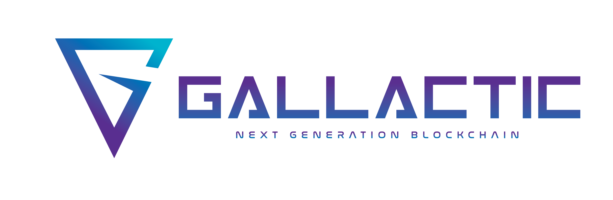

.. gallactic documentation master file, created by
   sphinx-quickstart on Fri Nov  9 11:40:08 2018.
   You can adapt this file completely to your liking, but it should at least
   contain the root `toctree` directive.

Welcome to Gallactic !
======================

Gallactic blockchain is built with `SputnikVM <https://github.com/gallactic/sputnikvm>`_ and `Tendermint <https://github.com/tendermint/tendermint>`_ consensus engine. 

Gallactic employs a Proof of Stake (PoS) consensus mechanism relies partially on the open source Tendermint project. The Tendermint consensus engine is a highly performant Practical Byzantine Fault Tolerant (PBFT) engine which is extremely modular/flexible and supports instant block finalization.

GALLACTIC uses a unique smart chain smart contract functionality to facilitate cross-chain transaction. It allows secure cross-chain value transfer and more importantly cross-chain smart contracting. 

To know more about gallactic glance our `whitepaper <https://cdn.gallactic.io/GALLACTIC-WHITEPAPER.pdf>`_.

Contents
--------

:ref:`Keyword Index <genindex>`, :ref:`Search Page <search>`

.. toctree::
   :maxdepth: 2

   quickstart.rst
   gallactic_key.rst
   private_chain.rst
   smart_contract.rst
   gallactic_vm.rst
   contribution.rst
    