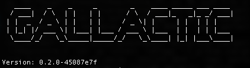

Quickstart
==========

********************************************
Setup your machine for gallactic development
********************************************
    The instructions below will allow you to setup a development environment and run a gallactic testnet. 
    If you have any issues please raise an issue in our `repo <https://github.com/gallactic/gallactic/issues>`_ or reach out on `Slack <https://gallactic.slack.com>`_

Prerequisite
------------

 1. Install `Go <https://golang.org/>`_ (version 1.11.1 or higher) and `Rust <https://www.rust-lang.org>`_. 
 2. Configure GOPATH and Rust in ~/.bashrc ~/.zshrc or ~/.bash_profile
 3. Git 
 
Setup instruction 
-----------------
    The set-up instructions are available for the following platforms:

    * Ubuntu
    * Mac 

Compiling the code :
^^^^^^^^^^^^^^^^^^^^
Compile and build the gallactic project. 

:: 

    mkdir -p $GOPATH/src/github.com/gallactic/gallactic
    cd $GOPATH/src/github.com/gallactic
    git clone https://github.com/gallactic/gallactic.git .
    make

Run ``gallactic version`` to make sure gallactic is properly compiled and installed in your machine.

Running Gallactic :
^^^^^^^^^^^^^^^^^^^

Initialize
""""""""""
Initialize the working directory by running:

:: 

    gallactic init -w=<workspace_directory>

This command will create config.toml, genesis.json and private key for validator.

Run your testnet
"""
Hurray !! All set to run a Gallactic node. 

::

    gallactic start -w=<workspace_directory>

This command will ask you to enter the private key of the validator. Enter the private key (priv_key) of the validator, as provided by the init command above. The Gallactic blockchain starts immediately, upon successful acceptance of the private key.

*************
Run in Docker
*************

Install `Docker <https://www.docker.com/>`_ and run the following commands to build the docker file:

:: 

    cd $GOPATH/src/github.com/gallactic/gallactic
    docker build . --tag gallactic

Then you can execute the Gallactic blockchain, using the docker:

:: 

    docker run -it --rm -v "/tmp/chain1:/gallactic"  gallactic init -w=/gallactic

